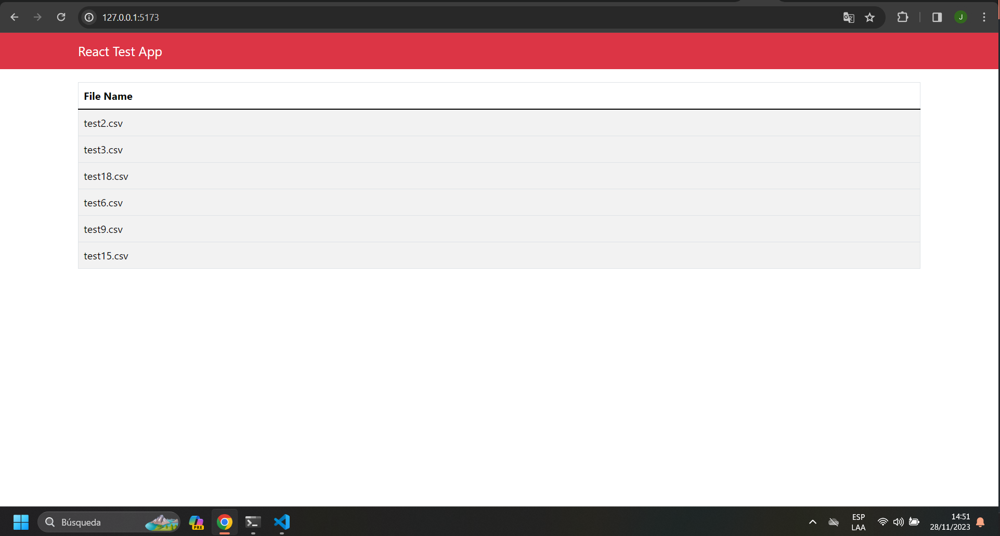
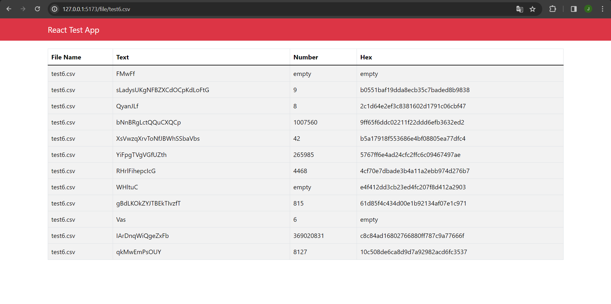

# Instalación y Configuración de Toolbox

Este repositorio contiene un proyecto que fusiona un backend desarrollado en Node.js con Express y un frontend en React, con bundling realizado a través de Webpack.

## Pasos de Instalación

### Clonar el repositorio

`git clone git@github.com:jesuscabrita/toolbox1.git`

### Backend (Node.js con Express) y Frontend (React) 

 Una vez clonado el repositorio, dirígete a la raíz del proyecto y ejecuta los siguientes comandos para instalar las dependencias:

`npm install`

 Luego, para iniciar el proyecto en modo de desarrollo, utiliza:

 `npm start`

Esto pondrá en marcha el servidor Express en el puerto predeterminado.

**Ejecutara el servidor**

estara corriendo en el puerto `http://localhost:5000/`

## Test
 los test del proyecto 

### Backend (Test)

Para iniciar las pruebas, asegúrate de estar en la raíz del proyecto y ejecuta:

`npm test`

**Esto ejecutará las pruebas de las rutas del proyecto.**

## Apis Disponibles:

prueba en postman:

`GET` : MUESTRA LA LISTA DE TODOS LOS ARCHIVOS QUE NO ESTAN VACIOS Y DESCARGADOS 

`http://localhost:5000/api/file/data`

`GET` : MUESTRA UN ARCHIVO EN ESPECIFICO EN ESTA CASO ESTA "test18.cvs"  de ejemplo

`http://localhost:5000/api/file/test18.csv`

## Scripts Disponibles

### Backend y Frontend

- `npm start`: Inicia el servidor Express después de realizar el empaquetado con Webpack
- `npm test:integration`: Ejecuta pruebas de integración.
- `npm test`: Ejecuta todas las pruebas.

## Dependencias Principales

### Backend

- **Express**: Framework web para Node.js.
- **axios**: Cliente HTTP para realizar peticiones.
- **cors**: Middleware para habilitar CORS.
- **morgan**: Logger para las solicitudes HTTP.
- **supertest**: Utilidad para pruebas de API HTTP.

### Frontend

- **React**: Biblioteca para construir interfaces de usuario.
- **react-router-dom**: Enrutamiento para aplicaciones React.
- **react-bootstrap**: Componentes de Bootstrap para React.
- **axios**: Cliente HTTP para realizar peticiones desde el frontend.

---

### imagenes del proyecto 

